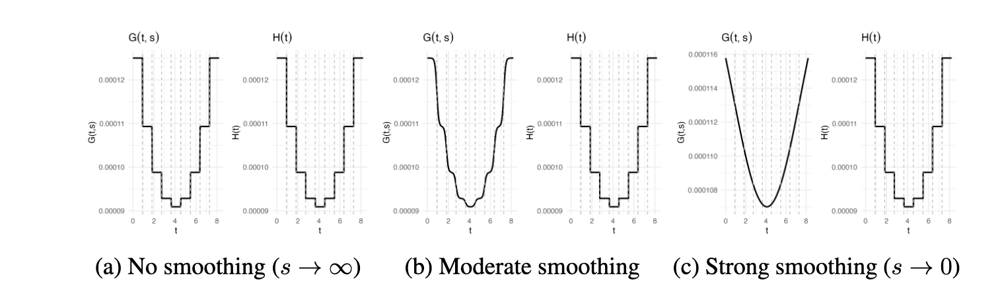

# SigmoidSmoother

**Smooth Skygrid Visualizer: Interactive Shiny App for $G(t,s)$ and $H(t)$**

This repository contains an interactive **R Shiny** app to visualize two related demographic functions under the **Smooth Skygrid** coalescent model.

---

## Mathematical Formulation

**Smoothed logistic formulation**

$$
G(t, s) = \frac{1}{\theta_1}
          + \sum_{k=1}^{M}
            \frac{\tfrac{1}{\theta_{k+1}} - \tfrac{1}{\theta_k}}
                 {1 + e^{-s (t - x_k)}}
$$

**Step-function analogue**

$$
H(t) = \frac{1}{\theta_1}
       + \sum_{k=1}^{M}
         \left(\tfrac{1}{\theta_{k+1}} - \tfrac{1}{\theta_k}\right)\,\mathbf{1}\{t \ge x_k\}
$$

Here, $\theta_j$ are effective population size parameters, $x_k$ are grid points in time, and $s$ controls the steepness of the transitions.  
As $s \to \infty$, $G(t,s)$ converges to the step function $H(t)$.

---

## Features

- Interactive sliders to set:
  - Number of transitions ($M$)  
  - Steepness parameter ($s$)  
  - Time range $[t_{\min}, t_{\max}]$  

- Dynamic input panels for custom $\theta_j$ values and transition times $x_k$  

- Options to:
  - Auto-space knots across the time interval  
  - Auto-smooth $\theta_j$ values with a sinusoidal default  
  - Toggle log-scale plotting for $H(t)$  

- Side-by-side plots of $G(t,s)$ (continuous logistic) and $H(t)$ (step function)  

- Diagnostics panel showing the current parameter configuration  

---

## Installation

Clone or download this repository, then open R:

```r
# Install required packages if not already installed
install.packages(c("shiny", "ggplot2", "gridExtra"))

# Run the app
library(shiny)
shiny::runApp("plot_SmoothSkygrid_G_H.R")
```

## Interpretation

Comparison of the Smooth Skygrid function $G(t,s)$ with its step-function analogue $H(t)$ across different smoothing levels. 
The functions are defined by 8 grid points with population size parameters $\theta_j^{\text{default}}$ and transition times $x_k$ given.

Panel (a) shows the step-function limit where $G(t,s)$ converges to $H(t)$ as $s \to \infty$, producing abrupt changes between grid intervals.

Panel (b) illustrates an intermediate case where transitions between grid cells are partially smoothed. 

Panel (c) demonstrates strong smoothing ($s \to 0$), in which transitions between successive grid intervals become broad and gradual.
